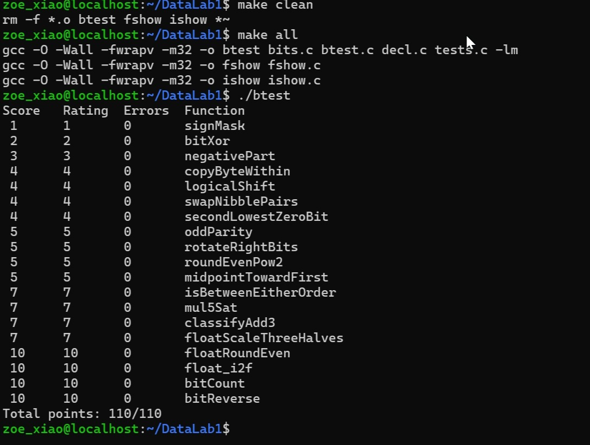

DataLab 1 实验报告 肖子仪 25300730061

执行./check_ops.py bits.c的截图!
[check_ops.py bits.c实验截图](../images/10095.png)

执行./btest的截图

P1-P19 实现思路
P1：将整数 1 左移 31 位，直接构造只设置最高位的掩码 "0x80000000"
P2：跟据异或等价式(x | y) & ~(x & y)，但是因为只能使用题目允许的~和&，所以将其改写为对等的~(~x & ~y)。
P3：先通过 x >> 31 生成符号掩码，~x + 1 生成补码相反数。两者按位与后，负数得到其相反数 -x ，非负数得到 0。
P4：把源字节右移src * 8，挪到最低8位提取出来，目标字节位置，把0xFF掩码左移到目标位置，再取反清空目标位置原来的数据。最后把拿到的源字节挪到目标位置，合并到数字里面。
P5：在C语言中会默认int右移是算术右移，负数高位会补1。所以先做算术右移，再手写一个低位全1、高位全0的掩码，和结果做按位与，把高位多余的1全部清成0，完成逻辑右移
P6：一个字节8位，将其分成高低各4位。用两组交错掩码，分别取出每个字节的低4位和高4位。低4位往左挪4位，高4位往右挪4位，最后用按位或拼在一起，实现字节内部高低4位的互换。
P7：先用 x & (x + 1) 拿到最低的0位，并把这一位置变成1，并拿更新后的数重复这个操作，就能找到原数从低位开始第二个为0的比特，生成对应的掩码。如果不存在第二个0，直接返回0。
P8：不断用异或等价式把32位的奇偶性，一层层折叠压缩到最低位。最后看最低位，如果1的总数是奇数则返回1，偶数则返回0。
P9：先进行算术右移拿到右移后的结果，再用掩码把符号扩展多出来的高位清理掉；同时将原数字左移（32-n）位，把从右边多出来的比特移到高位，最后把两部分合并。并且要用&31来保证左移的位移量控制在31以下。
P10：把低的n位当成余数，清空低位，得到向下取整的2的整数次幂。再判断余数大小，余数大于一半的时候进位，小于一半的时候不进位，刚好卡在一半的时候，看最低位，如果是奇数就进位。必须保证最终结果是偶数。
P11：用 (x & y) + ((x ^ y) >> 1) 计算不易溢出的中点基值；再判断 x 是否大于 y。当两数奇偶不同、精确中点落在两个整数之间时，比较两数的大小。若较大的端点是第一个参数x，就将基值加1，使结果选择更靠近x的整数。
P12：分开处理a、b正负端点。先比较符号，符号不一样就能直接判断大小；符号相同的情况下，通过x-a、x-b的正负号，判断x和a、b的大小。最后检查x是否落在[a,b]或者[b,a]这个闭区间里面。
P13：用 (x << 2) + x 算出 5*x 的32位结果。用4294967292和-4294967292判断5倍运算有没有超出int范围。用正负号判断是否溢出；如果溢出，根据正负选INT_MAX或者INT_MIN，最后用掩码在饱和值和正常乘积两个值中二选一。
P14：先算s=x+y，再算t=s+z。进行每一步时都要进行判断：两个正数相加结果变负数，相反两个负数相加结果变正数，就代表加法溢出。根据在哪一步溢出、以及溢出的符号返回结果，正数溢出返回1，负数溢出返回-1，没有溢出就返回0。
P15：将一个浮点数拆成符号、阶码、尾数三部分。如果阶码全1，直接原样子返回，非规格化浮点数，直接拿尾数乘3再除以2，规格化浮点数要补上隐藏的最高位，再对尾数做同样的计算。通过余数和最低位做就近偶数舍入，必要的时候调整阶码；阶码溢出就返回同符号无穷大。
P16：先进行判断，如果是NaN或者无穷大，直接原样返回。小于0.5直接归0；绝对值在0.5~1之间的（包括0.5），处理成整数边界。更大的小数，用掩码分开整数部分和小数部分，按照大于一半就进1、刚好一半看最低位的规则舍入。
P17：处理符号，拿到绝对值。扫描最高有效位，确定浮点数的阶码。按照位数移动，把整数的有效位放到23位尾数的位置。有效位太长的时候，检查余数和半单位，按就近偶数舍入；尾数进位的时候，同步把阶码加1。
P18：分治统计1的个数，先用掩码，在2个比特一组内部统计1的数量；再依次合并到4位、8位、16位、32位，最后返回全部1的总数。
P19：实质是分治交换比特，逐级交换相邻1位、2位、4位、8位、16位分组。每一级用对应的掩码把两边比特分开，交换位置之后合并，最终完成整个32位整数的比特反转。

本报告逐项依据本目录的bits.c中 P1–P19 的函数体以及注释。整数按 32 位二进制补码处理，右移为算术右移，整数表达式按 32 位位向量保留低 32 位；整数题限制运算符、常量和控制流，浮点题则通过unsigned的位模式实现且不能进行浮点运算。
